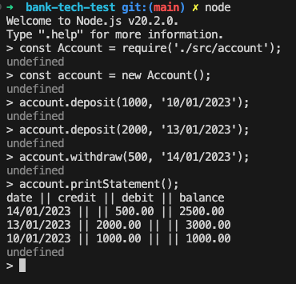

# Bank Account System

The bank account system consists of the following two classes: `Account` and `Statement`. The `Account` class allows for depositing and withdrawing money, while the `Statement` class generates an account statement.

## Setup

To use the bank account system, follow these steps:

1. Setup your environment to use node latest version: `nvm use node`.
2. Create an empty project directory and clone this repo in it. `https://github.com/aandre6891/bank-tech-test`.
3. Initialise the NPM project (this will create a file package.json): `npm init -y`.
3. Run node in your terminal:  `node`.
4. Require the class Account from the file account.js: `const Account = require('./src/account');`.
4. Create an instance of the `Account` class using the `new` keyword: `const account = new Account();`.
5. Use the available methods (`deposit`, `withdraw`, `printStatement`) to interact with the bank and generate statements. (use the example inputs below as a reference)
## Usage example inputs for Node

```javascript

`this code must be executed in the terminal`

const Account = require('./src/account');

const account = new Account();

account.deposit(1000, '10/01/2023');
account.deposit(2000, '13/01/2023'); 
account.withdraw(500, '14/01/2023');

account.printStatement();
```

## Account Class
The `Account` class represents a bank account and provides methods for depositing and withdrawing money.
### Methods

#### constructor()

The constructor initializes a new instance of the `Account` class with an empty account array and sets the balance to 0.

#### deposit(amount, date)

The `deposit()` method allows the user to deposit a specified amount of money into the account. It takes two parameters:

- `amount` (number): The amount of money to deposit.
- `date` (string): The date of the deposit.

#### withdraw(amount, date)

The `withdraw()` method allows the user to withdraw a specified amount of money from the account. It takes two parameters:

- `amount` (number): The amount of money to withdraw.
- `date` (string): The date of the withdrawal.

#### printStatement()

the `printStatement()` method calls the `print()` method on the `Statement` class passing the account's transaction history as an argument.


## Statement Class

The `Statement` class generates an account statement.

### Methods

### print()

The `print()` method prints a statement of the account, displaying the date, credit (deposit), debit (withdrawal), and balance after each transaction in the account.

## Example Output

```
date || credit || debit || balance
14/01/2023 || || 500.00 || 2500.00
13/01/2023 || 2000.00 || || 3000.00
10/01/2023 || 1000.00 || || 1000.00
```

The statement is displayed in the format: "date || credit || debit || balance", with each transaction represented as a row showing the corresponding details.

## Testing

To test the `Bank` class, you can use Jest, a popular JavaScript testing framework. Follow these steps to set up and run the tests:

1. Add the jest package to test the project: `npm add jest`.
2. Install jest "globally": `npm install -g jest`
3. Run the tests: `jest`

## Screenshot

